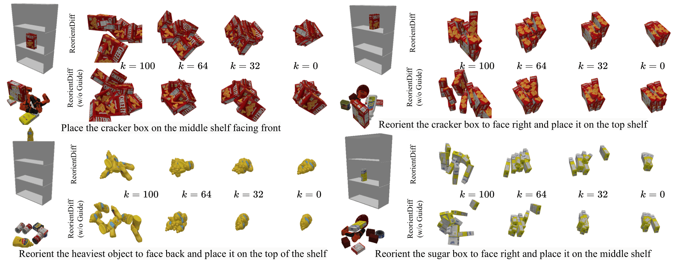

# ReorientDiff: Diffusion Model based Reorientation for Object Manipulation

Utkarsh A. Mishra and Yongxin Chen

## Abstract

The ability to manipulate objects in a desired configurations is a fundamental requirement for robots to complete various practical applications. While certain goals can be achieved by picking and placing the objects of interest directly, object reorientation is needed for precise placement in most of the tasks. In such scenarios, the object must be reoriented and re-positioned into intermediate poses that facilitate accurate placement at the target pose. To this end, we propose a reorientation planning method, ReorientDiff, that utilizes a diffusion model-based approach. The proposed method employs both visual inputs from the scene, and goal-specific language prompts to plan intermediate reorientation poses. Specifically, the scene and language-task information are mapped into a joint scene-task representation feature space, which is subsequently leveraged to condition the diffusion model. The diffusion model samples intermediate poses based on the representation using classifier-free guidance and then uses gradients of learned feasibility-score models for implicit iterative pose-refinement. The proposed method is evaluated using a set of YCB-objects and a suction gripper, demonstrating a success rate of 96.5\% in simulation. Overall, our study presents a promising approach to address the reorientation challenge in manipulation by learning a conditional distribution, which is an effective way to move towards more generalizable object manipulation.


## Methodology

We construct the scene-task representation feature space by using pre-trained foundation model like CLIP and a segmentation encoder:


We then use the scene-task representation to condition the diffusion model:


## Results

We evaluate our method on a set of YCB-objects and a suction gripper in simulation. The performance of the scene-task embedding network is shown in the following figure:

<p>
  
</p>

<!--  -->

The performance of the diffusion model is shown in the following figure:



## Videos

<p>
  
  
</p>
<p>
  
  
</p>
<p>
  
  
</p>
<p>
  
  
</p>

<!--         -->

[](https://www.youtube.com/watch?v=U2l2QQYdoNY)


## Citation

If you find this work useful in your research, please consider citing:

```
@article{mishra2023reorientdiff,
  title={ReorientDiff: Diffusion Models for Reorientation and Regrasping},
  author={Mishra, Utkarsh A and Chen, Yongxin},
  url={https://utkarshmishra04.github.io/ReorientDiff}
  year={2023}
}
```
